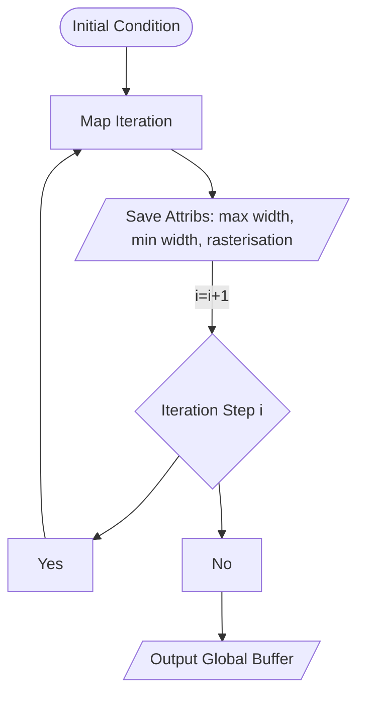
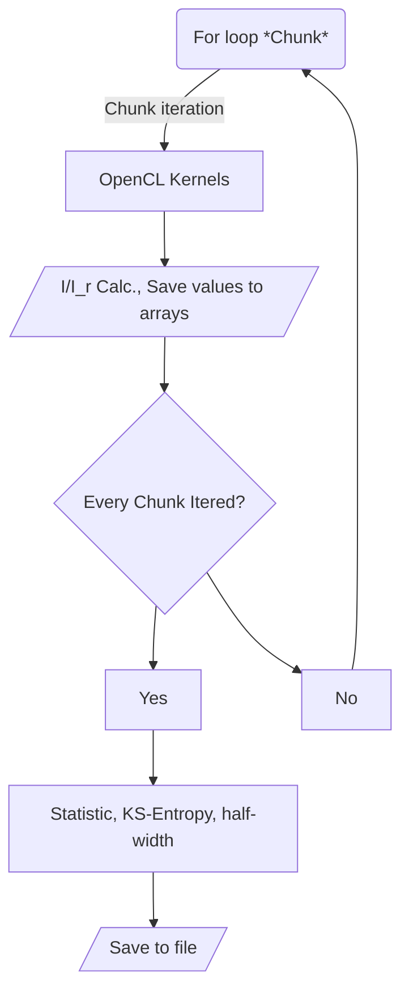

# Generalized Whisker Map  
This code is part of my thesis work by the name of _Estudio del Mapa de la Separatriz Generalizado_ (Study of a Generalized Whisker Map), to get a 5 years Ba. degree in Astronomy. Developed in Python with OpenCL 1.1 and implemented for GPGPUs.  
  
## About The Code  
*What this code does?* It calculates the evolution of an ensamble of initial conditions within the chaoctic layer (or stochastic layer) to get the half-width, metric entropy (KS-entropy), mLCE (maximal Lyapunov Caracteristic Exponent), and porosity of the layer.  
  
*How this attributes are calculated?* In a general manner, the equations that describes the dynamical system are iterated and in every step this attributes are calculated for every element in an ensamble of initial conditions. Let's see it in more detail.  
  
First, we need a free parameter, $\eta$, of the _whisker map_ (refer to *Mathematical Backgroud* section) and the half-width of the layer as a previous step (we get this values by iterating the map without calculating any attribute beside half-width and $\eta$). With these values the *device* (GPGPU side) program searches for the minimum and maximum value of the $y$ coordinate for every element in the ensamble, and stores in a global memory space each one (independent for every element in the ensamble). On the other hand, we use a *raster* (grid) to convert vector space information $(x,t,y)$ in counting information $(a[i][j] = n, i=1,\dots,N \wedge j = 1,\dots,M,\  N,M,n\in \mathbb{N})$, by the means of divide the surface area of the layer using the raster scaled cells with the previous half-width calculation. For every point that falls into a cell, the $a_{i,j}$ variable will add 1 into its value.  This process repeates for the $n_{it}$ iterations of the maps. So, the OpenCL Kernel will have the flowchart:
 

When reaches the total iteration step it returns the control to *host* program. 
At host side, we use Python (NumPy) to get the maximum and minimum value of array type variables and other statistics, input and output to files. And the host side program has the flowchart:


_In which devices can it run?_ In every OpenCL compliant device, but there's a caveat, it has intensive computation with a bulk of data, so it is expected to be run in a GPGPU or in the best of cases in a HPC device.  
  
  
## Mathematical Background  

Ecuation that describes de dynamical system,
```math
y' = y + \frac{1}{\lambda_{1}}\sin{t} - \frac{\upsilon}{\lambda_{1}}\cos{x},\\
t = t - \lambda_{1}\log{|y'|} + \tilde\eta,\quad  t\mod{2\pi},\\
x = x -\lambda_{2}\log{|y'| + \omega_{2}\tilde\eta,\quad  x\mod{2\pi},}
```

## Requisits

In order to get this program working, you will need to install OpenCL ICD for your device (make shure you have an OpenCL device compliant). If that so, install NumPy and PyOpenCL packages in your Python 3 enviroment:

```
pip install numpy pyopencl
```


## TODO List
Nowadays we are working on improving the readability of the code so we are in the stage of **housekeeping**. Much of the enviroment variables are hardwire into the code.

- [x] Replace cos(t) and sin(t) for sincos(t, *ptr) function.
- [ ] Housekeeping.
- [ ] Explicit use of FMA functions.
- [ ] Fixed raster scale. 
- [ ] Improve memory access.
- [ ] Output files from plain text to binary.


> Written with [StackEdit](https://stackedit.io/).
